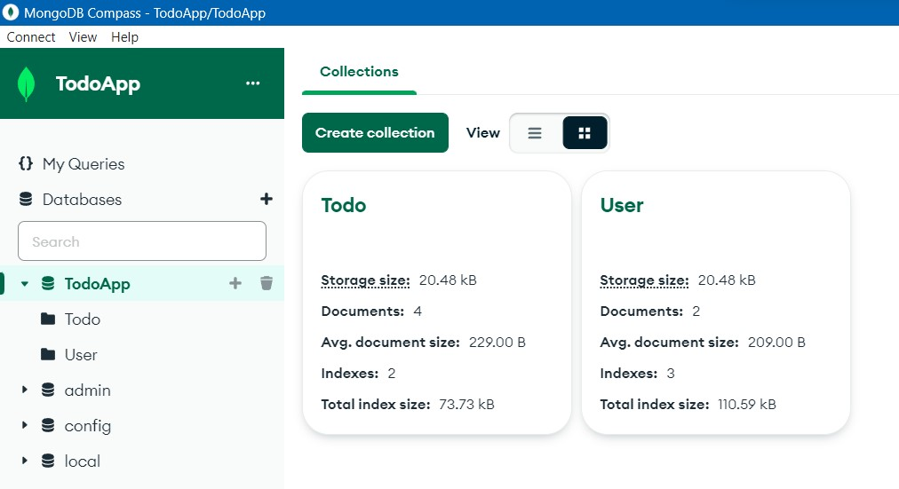
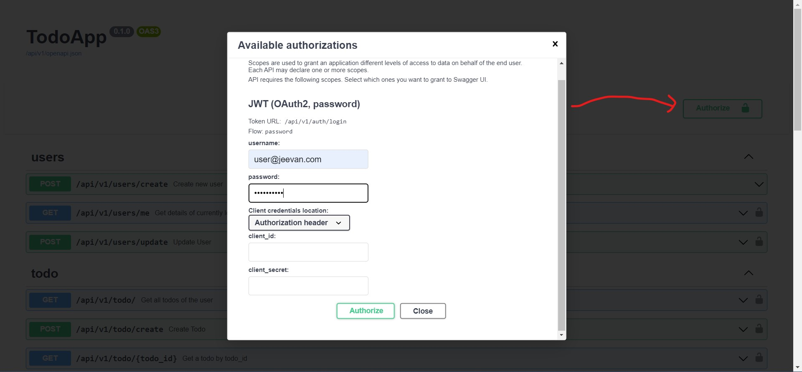

# TodoApi: Fastapi | MongoDB | REST API

</br>

## To Run in Local

1. Clone the project
```bash
>_ git clone https://github.com/SaiJeevanPuchakayala/FarmWiser.git
```
2. Install packages from requirements.txt
```bash
>_ pip install -r requirements.txt
```
3. Start server 
```bash
>_ uvicorn index:app --reload
```
4. Access APIs at
```
http://127.0.0.1:8000/docs
```

</br>

## MongoDB_Compass


## API Authorization


</br>


## Important Notes:
1. Schemas are just to built to understand the params and responses of the API clearly.
2. Most of the code files are built to create API docs in layman's terms. 

## References Used
```
https://intility.github.io/fastapi-azure-auth/multi-tenant/fastapi_configuration/
```